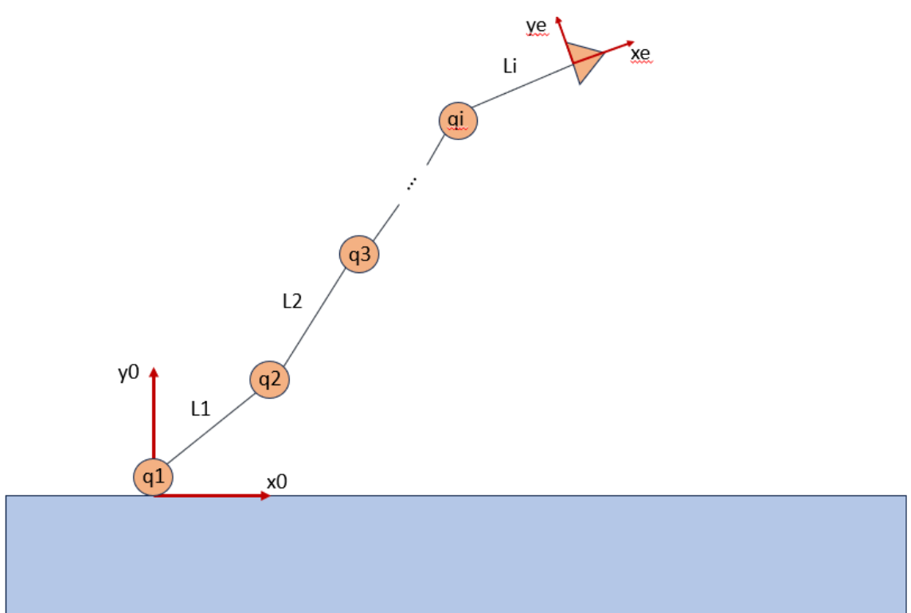

# dh_transform
This repository was developed to accomplish the proposed challenge of to implement the forward kinematics calculations for a 2D manipulator. Also, the use of node life cycle was required, so that the managed node calculate the Denavit Hartenberg (DH) parameters on its configuration in function of the links lengths and joint angles, considered as null at this point. After this, on the activation phase, the node gets the current joint angles from a topic with the message type [sensor_msgs/JointState](http://docs.ros.org/en/melodic/api/sensor_msgs/html/msg/JointState.html) and publish the end effector pose at a topic with message type of [geometry_msgs/Pose](http://docs.ros.org/en/noetic/api/geometry_msgs/html/msg/Pose.html). 

As the joint angles get updated, the DH need to be recalculated.

The complete challenge description can be find at ```resources/Robotics Challenge 2.pdf```

## Considerations
This solution was developed for a 2D manipulator composed of N rotation joints, N links and one end effector, as showed bellow
<div align="center">
  
</div>

## Nodes
### Encoder
This node is used to simulate a group of joint encoder's, publishing their angular position.

To run the node use
```bash
$ ros2 run dh_transform encoder
```

Now the server is ready to take requests on runtime to change the currant angular positions.
```bash
$ ros2 service call /update_angles dh_transform/srv/AnglesUpdate "{angles: [1.0, 2.0, 3.0]}"
```

*Note that the number of values passed (double) depend on the number of joint declared.*

### Pose Calculator
This class has the mathematical implementation of the forward kinematics operations. So, it takes the number of manipulator's links and their respective lengths. After this, it is possible to obtain the DH matrix that describe the manipulator.

### Pose publisher
This node gets the published angles and use the *Pose Calculator* methods to obtain and publish the end effector pose.

### Service client lifecycle
This service is responsible for trigger the transitions for the *pose_publisher* node. For now, the logic implemented consist in trigger the configure and the activation transitions if everything is alright. 
```bash
$ ros2 run dh_transform service_client_lifecycle.py
```

## Usage
For simplicity, there are a launch that start the executables *encoder*, the *pose_publisher* and the *service_client_lifecycle* at once. Notice that this launch also pass the manipulator description to the *pose_publisher*.
```bash
$ ros2 launch dh_transform pose_publisher_launch.py
```

## Tests
When implement new features or modifying the existing code, it is important to validate the expected code behaver both in the new implementation and in the existing features. So, to accomplish this, run the tests. First of all build the package.

```bash
$ colcon build
```
And run the tests
```bash
$ colcon test
```

Finally, inspect the results
```bash
$ colcon test-result --verbose
```

Or, in a compact form, run the three commands on a single line 
```bash
$ colcon build --packages-select dh_transform && colcon test --packages-select dh_transform --event-handler=console_direct+ && colcon test-result --verbose
```